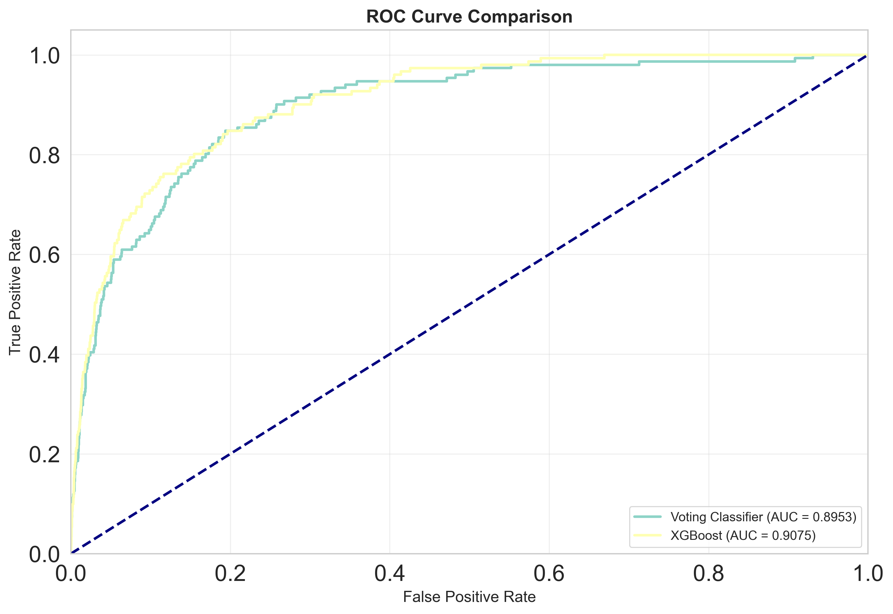
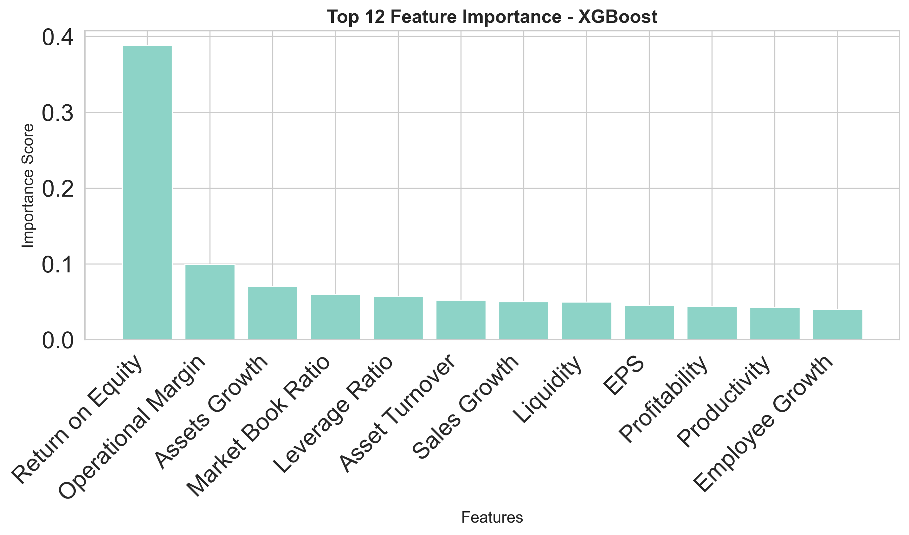
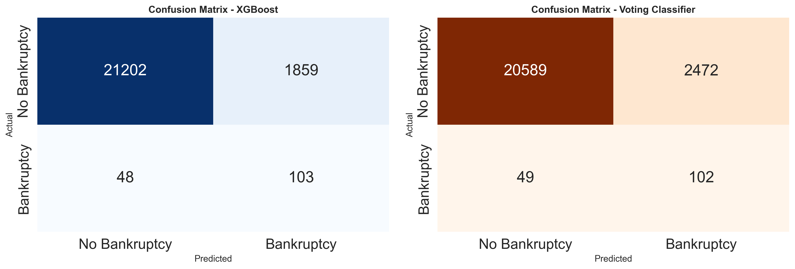

# Corporate Bankruptcy Prediction using Machine Learning

## Table of Contents

- [Introduction](#introduction)
- [Dataset Description](#dataset-description)
- [Project Structure](#project-structure)
- [Installation & Requirements](#installation--requirements)
- [Workflow](#workflow)
  - [Step 1: Exploratory Data Analysis (EDA)](#step-1-exploratory-data-analysis-eda)
  - [Step 2: Data Preprocessing](#step-2-data-preprocessing)
  - [Step 3: Model Training](#step-3-model-training)
  - [Step 4: Evaluation & Comparison](#step-4-evaluation--comparison)
- [Results](#results)
- [Conclusion](#conclusion)
- [References](#references)

---

## Introduction

This project builds machine learning models to predict corporate bankruptcy risk based on financial indicators. This is a **binary classification problem on highly imbalanced data** (bankruptcy class represents only 0.6% of samples), known as a *rare-event prediction* task — very common in financial risk assessment.

### Objectives:
- Determine whether a company is at risk of bankruptcy based on financial metrics.
- Compare performance across multiple classification algorithms.
- Identify the optimal model for highly imbalanced data.
- Interpret the most important financial indicators influencing bankruptcy prediction.

### Business Impact:
In finance, correctly identifying at-risk companies is critical:
- **False Negatives (missed bankruptcies):** High cost — investors lose capital.
- **False Positives (false alarms):** Lower cost — conservative in decision-making.
  
This drives the focus on **Recall and AUC** over raw Accuracy.

---

## Dataset Description

The **bankruptcy_data.xlsx** dataset contains **92,872 observations** with **12 financial features** and **1 target variable**.

### Financial Features

| Feature | Description |
|:---|:---|
| **EPS** | Earnings Per Share |
| **Liquidity** | Cash conversion ability of assets |
| **Profitability** | Profit generation capability |
| **Productivity** | Operational efficiency in value creation |
| **Leverage Ratio** | Debt to equity ratio |
| **Asset Turnover** | Efficiency of asset utilization |
| **Operational Margin** | Operating profit margin |
| **Return on Equity (ROE)** | Return on shareholder capital |
| **Market Book Ratio** | Market value vs. book value |
| **Assets Growth** | Asset growth rate |
| **Sales Growth** | Revenue growth rate |
| **Employee Growth** | Workforce growth rate |

### Target Variable

| Value | Meaning |
|:---|:---|
| `BK = 0` | **Non-bankrupt** (99.4% of data) |
| `BK = 1` | **Bankrupt** (0.6% of data — 558 samples) |

> **Note:** This extreme imbalance (0.6%) is the core challenge. A naive classifier predicting all non-bankrupt would achieve ~99% accuracy while catching zero bankruptcies!

---

## Project Structure

```
bankruptcy_prediction/
├── README.md                          # Project documentation
├── requirements.txt                   # Python dependencies
├── .gitignore                         # Git ignore file
├── data/
│   └── bankruptcy_data.xlsx           # Input financial dataset
├── notebooks/
│   └── project.ipynb                  # Main Jupyter Notebook with full analysis
└── images/                            # Generated visualizations
    ├── 01_roc_curve.png               # ROC curve comparison
    ├── 02_feature_importance.png      # Feature importance ranking
    ├── 03_confusion_matrices.png      # Confusion matrix heatmaps
```

### Directory Descriptions

| Directory | Contents |
|:---|:---|
| **data/** | Raw and processed data files (Excel, CSV formats) |
| **notebooks/** | Jupyter notebooks for EDA, preprocessing, and modeling |
| **images/** | Generated plots and visualizations for documentation |
| **root/** | Configuration files, documentation, and dependency tracking |


## Installation & Requirements

### Environment
- Python 3.13+
- Jupyter Notebook / VS Code

### Quick Install

Install all dependencies from the requirements file:

```bash
pip install -r requirements.txt
```

### Required Libraries

| Library | Purpose |
|:---|:---|
| `numpy`, `pandas` | Data manipulation and analysis |
| `scipy` | Statistical computing, Winsorization |
| `matplotlib`, `seaborn` | Data visualization |
| `missingno` | Missing data pattern visualization |
| `scikit-learn` | ML algorithms, preprocessing, evaluation |
| `imbalanced-learn` | Imbalance handling (SMOTE, ENN, ImbPipeline) |
| `xgboost` | Advanced gradient boosting |
| `openpyxl` | Excel file reading/writing |

---

## Workflow

### Step 1: Exploratory Data Analysis (EDA)

#### 1.1 Data Types
- All features are `float64`, target variable `BK` is binary `int64`.
- Data is ML-ready; no encoding needed.

#### 1.2 Distributions & Basic Statistics
- Most features show **skewed distributions** with heavy tails — typical of financial data.
- Large Min-Max ranges compared to IQR indicate high volatility.

#### 1.3 Class Imbalance Detection
- Bankrupt class (`BK = 1`) represents only **0.6%** (558 out of 92,872 samples).
- This is a *rare-event* classification problem requiring specialized techniques.

#### 1.4 Outlier Analysis
- **12–17% of data** contains outliers across most variables.
- Many outliers are **legitimate bankruptcy indicators** (negative ROE, high debt, low profits) → cannot be removed.
- **Decision:** Retain all observations, use Winsorization to dampen extreme values.

#### 1.5 Feature Correlation
- No feature pairs show high correlation (all < 0.7).
- No multicollinearity concerns; retain all 12 features for maximum information.

#### 1.6 Duplicate Records
- Identified and removed duplicates; all 558 bankrupt samples preserved.

#### 1.7 Missing Data Patterns
- Several columns have missing values (<20% each):
  - `Employee Growth`, `Assets Growth`, `Sales Growth`, `Operational Margin` are most affected.
- Strong correlation between missing values in related groups:
  - `Asset Turnover`, `Profitability`, `Productivity`, `Liquidity` — 100% coincident missing.
  - `Assets Growth` and `Sales Growth` — 100% coincident missing.
- **Handling approach:** KNN Imputer (leverages high correlation between features).

---

### Step 2: Data Preprocessing

All preprocessing follows a strict sequential pipeline to prevent **data leakage**.

#### 2.1 Train/Test Split

```
Train: 75% | Test: 25% (random_state=42)
```

> **Critical:** Split BEFORE any preprocessing. Test set remains completely unseen during training.

#### 2.2 Missing Value Imputation — KNN Imputer

- **Configuration:** `n_neighbors=5`, `weights='distance'`, `metric='nan_euclidean'`
- **Fit:** Only on training data; transform both train and test.
- **Rationale:** Financial data has correlated features, allowing accurate missing value prediction from neighbors.

#### 2.3 Outlier Handling — Winsorization (5% – 95%)

- Values below the 5th percentile or above the 95th percentile are clipped to those bounds.
- **Percentile boundaries:** Calculated from training data only; applied uniformly to train and test.
- **Advantage:** Reduces extreme value impact while preserving sample count — no data loss.

#### 2.4 Class Imbalance Resampling — SMOTE-ENN

- **SMOTE** (Synthetic Minority Oversampling): Generates synthetic minority samples via interpolation between k-nearest neighbors (`k=5`).
- **ENN** (Edited Nearest Neighbours): Removes noisy synthetic samples that fall too close to majority boundary (`k=3`).
- **Combined SMOTE-ENN:** First oversample, then denoise → balanced, clean data.
- **Applied:** Training set only; test set remains in original distribution.

#### 2.5 Feature Scaling — RobustScaler

- Scales using median and IQR instead of mean and standard deviation.
- **Rationale:** Financial data retains outliers even after Winsorization; RobustScaler is more robust.

#### 2.6 Complete Preprocessing Pipeline

```
Raw Data
  │
  ├── Train/Test Split (75/25, stratified)
  │
  ├── [TRAINING PATH]
  │   ├── KNN Imputer (fit + transform)
  │   ├── Winsorization (calculate bounds + apply)
  │   ├── SMOTE-ENN (balance classes) ─── [Feed to Voting Classifier]
  │   └── RobustScaler (fit + transform)
  │
  └── [TEST PATH]
      ├── KNN Imputer (transform only)
      ├── Winsorization (apply training bounds)
      └── RobustScaler (transform only)
```

---

### Step 3: Model Training

Five algorithms tested, with emphasis on handling class imbalance:

#### 3.1 Logistic Regression (Baseline)

- **Role:** Establishes baseline performance.
- **Mechanism:** Probabilistic model using sigmoid function.
- **Output:** Coefficients show direction and magnitude of feature impact.

#### 3.2 Random Forest

- **Role:** Evaluates non-linear relationships.
- **Mechanism:** Ensemble of decision trees; majority voting.
- **Parameters:** `n_estimators=10`, `max_features='sqrt'`, `random_state=21`

#### 3.3 Gaussian Naive Bayes

- **Role:** Tests probabilistic conditional approach.
- **Mechanism:** Applies Bayes' theorem assuming feature independence and Gaussian distribution.

#### 3.4 Voting Classifier (Soft Voting Ensemble)

- **Role:** Combines strengths of above three models.
- **Mechanism:** Averages probability predictions from Logistic Regression, Random Forest, and Naive Bayes.
- **Stability Evaluation:** Stratified K-Fold CV (K=5) with `ImbPipeline`:
  - SMOTE-ENN applied **within each fold** only — prevents data leakage.
  - Class ratio maintained across folds.

#### 3.5 XGBoost (Advanced Proposal)

- **Role:** Optimized solution for imbalanced data.
- **Mechanism:** Gradient boosting — sequential trees, each correcting predecessor's errors.
- **Imbalance Handling:** `scale_pos_weight = ratio` (minority/majority sample count):
  - Increases weight of minority class in loss function.
  - Trains on original data (no SMOTE) → avoids synthetic sample artifacts.
- **Parameters:** `n_estimators=100`, `learning_rate=0.05`, `max_depth=5`
- **Scaler:** `RobustScaler` fit on original training data (pre-resampling).

---

### Step 4: Evaluation & Comparison

#### Evaluation Metrics

| Metric | Definition | Importance |
|:---|:---|:---|
| **Accuracy** | % correct predictions overall | Can be misleading on imbalanced data |
| **Precision** | % of "bankruptcy" predictions that are correct | Reduces false alarms |
| **Recall** | % of actual bankruptcies caught | **HIGH PRIORITY** — minimize missed risks |
| **F1 Score** | Harmonic mean of Precision & Recall | Balanced summary metric |
| **AUC** | Area under ROC curve | Class separation ability |
| **Specificity** | % non-bankrupt correctly identified | Avoids false alarms |
| **MCC** | Matthews Correlation Coefficient | Most robust metric for imbalanced data |

#### Advanced Evaluation Methods
- **Confusion Matrix:** Visual breakdown into TP, TN, FP, FN
- **ROC Curve:** FPR vs. TPR across thresholds
- **Precision-Recall Curve:** Specialized for imbalanced data
- **Feature Importance:** Identifies most influential financial indicators

---

## Results

### Overall Performance Comparison

| Model | Accuracy | Precision | Recall | F1 Score | AUC |
|:---|:---:|:---:|:---:|:---:|:---:|
| Logistic Regression | 85.99% | 0.0331 | 0.7285 | 0.0633 | 0.8747 |
| Random Forest | 98.32% | 0.1033 | 0.2053 | 0.1375 | 0.8215 |
| Naive Bayes | 82.44% | 0.0281 | 0.7748 | 0.0543 | 0.8641 |
| Voting Classifier | 89.14% | 0.0396 | 0.6755 | 0.0749 | 0.8953 |
| **XGBoost** | **91.78%** | **0.0525** | **0.6821** | **0.0975** | **0.9075** |

### XGBoost vs. Voting Classifier (Detailed Comparison)

| Metric | XGBoost | Voting | Improvement |
|:---|:---:|:---:|:---:|
| Accuracy | 91.78% | 89.14% | +2.64% |
| Precision | 0.0525 | 0.0396 | +32.6% |
| Recall | 0.6821 | 0.6755 | +1.0% |
| F1 Score | 0.0975 | 0.0749 | +30.2% |
| Specificity | 0.9194 | 0.8928 | +3.0% |
| AUC | 0.9075 | 0.8953 | +1.4% |
| MCC | 0.1738 | 0.1455 | +19.5% |

### Visualizations

#### ROC Curve Comparison


Both XGBoost and Voting Classifier show excellent discrimination ability (AUC > 0.89). XGBoost achieves the steepest initial rise, indicating superior true positive detection with minimal false positive rate.

#### Feature Importance Analysis


**Key Findings:**
- **ROE (Return on Equity) dominates at 38.8%** — the strongest bankruptcy predictor
- Bankrupt firms typically show negative/declining ROE (eating into shareholder capital)
- **Operational Margin (10.0%)** — profitability from core business
- **Assets & Sales Growth (7.0%, 5.0%)** — stagnation correlates with bankruptcy risk
- Lower importance on others indicates good feature diversity

#### Confusion Matrices


XGBoost achieves:
- TN = 21,202 (correctly identified non-bankruptcies)
- TP = 103 (correctly identified bankruptcies)
- FN = 48 (missed bankruptcies — manageable)
- FP = 1,859 (false alarms — acceptable cost)


### Top 10 Feature Importance

| Rank | Feature | Importance | Interpretation |
|:---:|:---|:---:|:---|
| 1 | Return on Equity | 0.3880 | **Leading bankruptcy indicator** |
| 2 | Operational Margin | 0.0997 | Core business profitability |
| 3 | Assets Growth | 0.0702 | Growth/stagnation signal |
| 4 | Market Book Ratio | 0.0601 | Market confidence vs. book value |
| 5 | Leverage Ratio | 0.0573 | Debt burden level |
| 6 | Asset Turnover | 0.0524 | Asset utilization efficiency |
| 7 | Sales Growth | 0.0504 | Revenue expansion capability |
| 8 | Liquidity | 0.0499 | Short-term financial health |
| 9 | EPS | 0.0451 | Per-share profitability |
| 10 | Profitability | 0.0441 | Overall profit generation |

> **Insight:** ROE's dominance (nearly 4x the second feature) reflects financial reality: if a company systematically loses money on shareholder capital, bankruptcy is imminent. The large gap between ROE and others suggests the model's decision heavily depends on this single indicator.

### Cross-Validation Robustness

Stratified K-Fold CV Results for Voting Classifier (K=5, with ImbPipeline):

| Metric | Mean | Std Dev |
|:---|:---:|:---:|
| AUC | 0.8928 | ±0.0152 |
| F1 Score | 0.0725 | ±0.0043 |

**Interpretation:** Minimal standard deviations confirm robust, consistent performance across different data partitions—no overfitting.

---

## Conclusion

### Key Findings

1. **XGBoost is the optimal model** for corporate bankruptcy prediction on highly imbalanced data:
   - AUC = 0.9075 (excellent discrimination)
   - MCC = 0.1738 (positive correlation in extreme imbalance)
   - Outperforms Voting Classifier and all individual models on all major metrics

2. **`scale_pos_weight` approach superior to SMOTE** for XGBoost:
   - Train on original data with weighted loss function
   - Avoid synthetic sample artifacts  
   - Cleaner, more interpretable decision boundary

3. **ROE is the dominant bankruptcy predictor** (38.8% importance):
   - Negative/declining ROE signals capital destruction
   - Aligns with financial theory on insolvency
   - Model has captured fundamental economic principle

4. **Strong model stability:**
   - Cross-validation scores vary minimally across folds
   - Robust generalization to unseen data
   - No significant overfitting

5. **Practical performance metrics:**
   - Catches **68% of actual bankruptcies** (high recall)
   - Only **9% false alarm rate on bankruptcy calls** (reasonable precision)
   - **92% correctly identify healthy firms** (high specificity)

### Limitations & Future Work

- **F1 Score remains modest (0.098)** due to inherent class imbalance (0.6%) — even perfect models struggle.
- **Recommendations for improvement:**
  - Hyperparameter optimization (GridSearchCV, Bayesian Optimization)
  - Test LightGBM, CatBoost alternatives
  - Advanced feature engineering / selection
  - Decision threshold optimization based on business cost model
  - Ensemble of multiple XGBoost models with different hyperparameters

---

## Setup & Usage

### Initial Setup

1. **Clone or download the repository:**
   ```bash
   cd bankruptcy_prediction
   ```

2. **Create and organize the directory structure:**
   ```bash
   mkdir -p data notebooks images
   ```

3. **Move data files:**
   - Place `bankruptcy_data.xlsx` in the `data/` folder

4. **Move notebook file:**
   - Place `project.ipynb` in the `notebooks/` folder

5. **Install dependencies:**
   ```bash
   pip install -r requirements.txt
   ```

6. **Launch Jupyter Notebook:**
   ```bash
   jupyter notebook notebooks/project.ipynb
   ```

### Running the Analysis

1. Open `notebooks/project.ipynb` in Jupyter Notebook or VS Code
2. Execute cells sequentially from top to bottom
3. All visualizations will be automatically saved to `images/` folder
4. Generated plots are referenced in the README

### Key Random State
- All operations use `random_state=42` for reproducibility
- Cross-validation uses stratified splitting to maintain class balance

---

## References

1. [DATA-SCIENCE-FOR-FINANCE / Bankruptcy Prediction — serkannpolatt](https://github.com/serkannpolatt/DATA-SCIENCE-FOR-FINANCE/tree/main/Bankruptcy%20Prediction)
2. [Bankruptcy Prediction Using Machine Learning Techniques — MDPI](https://www.mdpi.com/1911-8074/15/1/35)
3. [Bankruptcy Prediction Using Machine Learning Models — IJSREM](https://ijsrem.com/download/predicting-bankruptcy-with-machine-learning-models/)
4. [Machine Learning Applications in Bankruptcy Risk Forecasting — KTPT NEU](https://ktpt.neu.edu.vn/Uploads/Bai%20bao/2023/So%20310/380842.pdf)

---

**Generated:** Python 3.13 | Jupyter Notebook | scikit-learn, imbalanced-learn, XGBoost

**Author Notes:** This comprehensive pipeline demonstrates best practices for machine learning on imbalanced financial datasets, including proper data leakage prevention, stratified cross-validation, and appropriate metric selection for rare-event prediction.